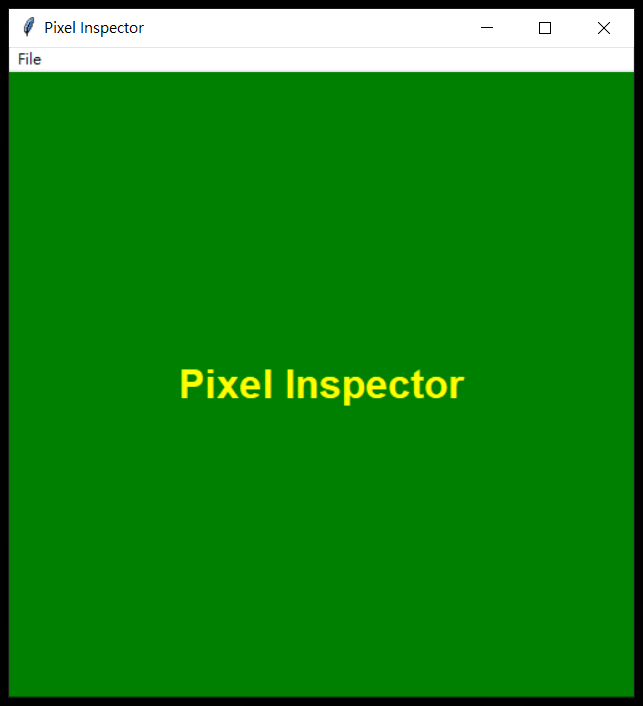
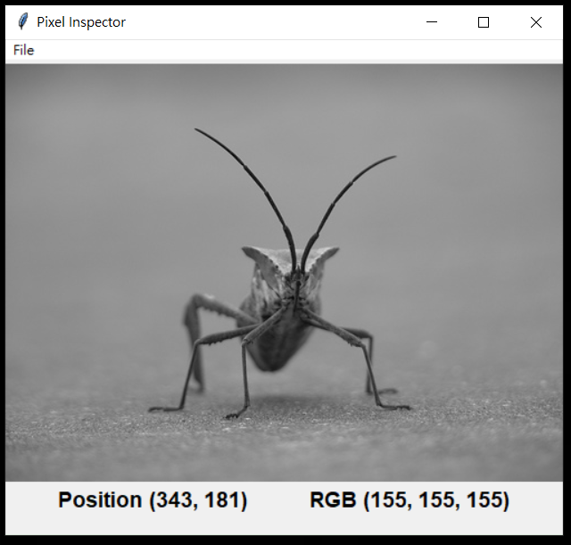

# pixel-inspector

A simple pixel inspector for reading RGB or RGBA pixel values of the images.

## Requirements

* Python 3.8 or above. (This piece of work was developed with Python 3.8.5).
* numpy
* matplotlib
* tkinter (, which is the standard Python interface to the Tk GUI toolkit. Hence, no need to install it.)
* Only png files are supported.

## Usage

* Change to the project directory, `python display.py` will launch the GUI interface of this pixel inspector.
  * In the `File` menu, `Open` to load a new image for the inspection, and `Exit` to close the program.
  * Entry Page
  * 
  * Inspector Page
  * 
  * Notice: the position is in (x,y) where x is the horizontal direction and y is the vertical direction, and it counts from (0,0).
* Use the class `PixelInspector` in `inspector.py` to inspect the pixels with the command line.
  * For example,
  * `python`
  * `>>>import inspector`
  * `>>>pi = inspector.PixelInspector('./demo/stinkbug.png')`
  * `>>>print(pi.inspect(300, 300))`

## Demo

* `python`
* `>>>import inspector`
* `>>>pi = inspector.PixelInspector.demo()`

## Resources

* The demo image (demo/stinkbug.png) is from [Matplotlib Image tutorial](https://matplotlib.org/2.0.0/_images/stinkbug.png).
